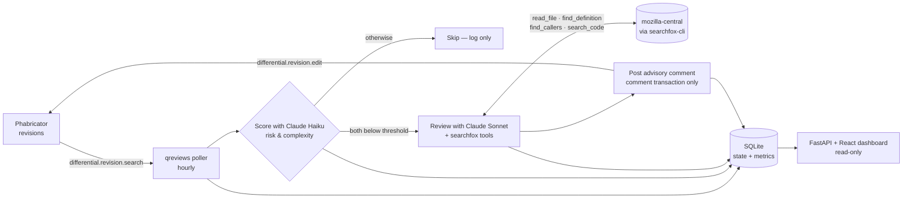

# qreviews

**Autonomous, gated AI code review for Mozilla Phabricator.** qreviews
watches `phabricator.services.mozilla.com` for new revisions tagged with
specific reviewer groups, scores each one for risk and complexity, and —
only when both scores are low — posts an advisory review comment generated
by a tailored Claude skill so a human reviewer can ratify it quickly.

---

## Why qreviews exists

A few problems show up consistently in review queues for Firefox engineering
teams (initially Home & New Tab, and IP Protection):

- **Engineers worry that AI reviews bias their outcomes.** Opt-in AI review
  tools can feel like they put a thumb on the scale, and people are right to
  be skeptical.
- **Opt-in tools are unevenly used.** A handful of power-users request AI
  review on every patch; most patches never get one.
- **Patches sit unreviewed for too long.** The review queue is long enough
  that even routine changes can wait days.
- **Complex patches lose attention.** When reviewers are drowning in small,
  low-risk changes, the patches that actually need careful eyes get less
  scrutiny than they deserve.

qreviews' answer is a narrower one than "AI reviews everything." It only
acts on revisions that score low on both **risk** and **complexity**, posts
a non-binding advisory comment, and leaves the formal accept/reject decision
to a human. The goal is to clear the easy queue so reviewers can spend their
attention on the hard stuff — not to replace human judgment.

As the rubric improves and teams get comfortable, we raise the thresholds,
and eventually open the bot up to revisions from outside the immediate
review group. The bot never blocks, never accepts, and never rejects.

---

## How it works



1. **Discover.** The poller calls `differential.revision.search` filtered by
   each configured reviewer group's PHID and a `modifiedStart` watermark.
   By default it only considers revisions whose author is a member of that
   group's Phabricator project (`restrict_to_member_authors: true`).
2. **Score.** For each new revision (or new diff on an existing revision),
   the bot calls Claude Haiku to score risk and complexity on a 0–10 scale.
   Strict JSON output, factors cited per axis.
3. **Gate.** If `risk < risk_threshold` **and** `complexity < complexity_threshold`
   (defaults: both `< 3`, i.e. score must be 0, 1, or 2), the bot proceeds
   to review. Otherwise it records the scores and skips.
4. **Review.** Loads the configured `SKILL.md` for the reviewer group and
   runs a multi-turn Claude Sonnet conversation. The model has read-only
   tool access to mozilla-central via `searchfox-cli` for context: file
   contents, symbol definitions, callers/callees, and text/regex search.
   Output is Markdown.
5. **Post.** Renders a templated advisory comment (scores + factors +
   review) and posts a single `comment` transaction via
   `differential.revision.edit`.
6. **Track.** Every step lands in SQLite and surfaces on the dashboard.

> **Non-blocking by design.** The only Phabricator write operation in the
> entire codebase is a `comment` transaction. qreviews has no path to
> accept, reject, or request changes on a revision.

---

## Where it runs & what it can touch

qreviews is hosted on **Railway** at
[`qreviews-production.up.railway.app`](https://qreviews-production.up.railway.app),
as a single service running the poller daemon and the dashboard side-by-side
against a SQLite file on a persistent volume. Railway autodeploys from
`main`.

It polls Phabricator **hourly** (the repo default). Push-based triggering
via Herald webhooks is wired up in code but not yet enabled in production —
see [Next steps](#next-steps).

**Phabricator access.** qreviews authenticates with a Conduit API token
scoped to a dedicated bot account. The read surface is:

- `project.search` — resolve reviewer-group slugs to PHIDs and enumerate
  group members.
- `differential.revision.search` — find needs-review revisions.
- `differential.diff.search` and `differential.getrawdiff` — fetch raw
  diffs.
- `transaction.search` — detect human engagement on a revision.
- `conduit.ping` — health check.

The write surface is exactly one call: `differential.revision.edit` with a
single `comment` transaction. The bot has no code path that emits `accept`,
`reject`, or `request-changes` transactions.

**mozilla-central access.** Read-only, via `searchfox-cli` against the
public searchfox index. No checkout, no build.

**Anthropic access.** Scoring uses Claude Haiku; review uses Claude Sonnet.
Token caps in `config.yaml` (`scoring_max_tokens`, `review_max_tokens`)
bound runaway cost. Per-call cost is recorded in SQLite and shown on the
dashboard.

---

## Onboarding a new team

The ramp is deliberately cautious. The point is for teams to gain
confidence in the bot at low stakes before widening its reach.

1. **Write a `SKILL.md`** for the team's review rubric under
   `skills/<team>-review/SKILL.md`. The skill is loaded verbatim into the
   review prompt, so it should encode the things a reviewer for that area
   would actually look for.
2. **Register the reviewer group** in `config.yaml` with the team's
   Phabricator project slug, point `skill_path` at the new SKILL.md, and
   leave `risk_threshold` / `complexity_threshold` at the defaults (`3`,
   strictly less than — so only revisions scoring 0/1/2 get auto-reviewed).
   Leave `restrict_to_member_authors: true` (the default) so only revisions
   authored by group members are considered. Run
   `python -m qreviews resolve-phids` to cache the new PHID.
3. **Watch the dashboard** for a few weeks. Read the posted reviews, tune
   the rubric, raise thresholds as the team gets comfortable.
4. **Open up to external authors** by setting
   `restrict_to_member_authors: false` once the team is happy with quality
   — automated reviews will then apply to any revision sent to the group,
   regardless of who authored it.

A human reviewer always formally accepts or rejects; qreviews stays purely
advisory throughout.

---

## Long-term vision

The "gated AI assistance" pattern qreviews uses for code review extends
naturally to other parts of the Firefox SDLC. Roughly in priority order:

- **Bug triage** — assist with component routing, severity, and priority on
  newly filed Bugzilla bugs, with the same low-risk-only gate.
- **Bug reproduction & regression finding** — drive
  [mozregression](https://mozilla.github.io/mozregression/) automatically
  for regressions where the steps to reproduce are unambiguous, and report
  the bisect range back to the bug.
- **Visual-diff comparison** — use
  [mozscreenshots](https://wiki.mozilla.org/Firefox/mozscreenshots) to
  detect and surface UI regressions on candidate patches, again as an
  advisory signal rather than a blocking check.

Each of these inherits qreviews' core constraints: only act on the
clearly-low-risk cases, never block humans, always leave the final
decision to a person.

---

## Next steps

Concrete near-term work, in roughly the order it's likely to land:

- **Herald push triggers.** Replace hourly polling with Phabricator Herald
  webhooks. The webhook route already exists at `POST /phabricator/herald`
  and verifies HMAC-SHA256 signatures — what's left is wiring up the Herald
  rule in Phabricator and setting `PHABRICATOR_WEBHOOK_SECRET` in
  production. Faster feedback, lower Conduit load.
- **Low-quality-review flagging.** Add a dashboard affordance to mark a
  posted review as low-quality, with the reason. Feeds back into rubric
  and prompt iteration, and gives us a real signal for tuning thresholds.
- **Inline per-line Phabricator comments.** Today the bot posts a single
  top-level advisory comment; richer feedback would land as inline
  comments on the diff.
- **Quality-proxy panel.** Track what percentage of bot-reviewed revisions
  land without further back-and-forth.
- **Dashboard authentication** for non-local deployments.

---

## Quickstart

```bash
# 1. Install (Python 3.11+ required)
uv pip install -e ".[dev]"
#   or: pip install -e ".[dev]"

# 2. Set up secrets
cp .env.example .env
$EDITOR .env       # paste your PHABRICATOR_API_TOKEN and ANTHROPIC_API_KEY

# 3. Initialize the database
python -m qreviews init-db

# 4. Resolve reviewer-group PHIDs (one-time, cached in SQLite)
python -m qreviews resolve-phids

# 5. Try a single revision in dry-run (does NOT post to Phabricator)
python -m qreviews review D123456

# 6. Or run the polling loop
python -m qreviews poll --dry-run        # safe — no posts
python -m qreviews poll                  # live — posts advisory comments

# 7. View the dashboard
python -m qreviews dashboard
# → http://127.0.0.1:8765
```

---

## Configuration

`config.yaml` controls everything except secrets. Edit it freely; no rebuild
needed.

```yaml
phabricator:
  base_url: https://phabricator.services.mozilla.com/api/
  poll_interval_seconds: 3600
  max_diff_bytes: 200000              # skip larger diffs entirely

anthropic:
  scoring_model: claude-haiku-4-5-20251001
  review_model: claude-sonnet-4-6

defaults:
  risk_threshold: 3                   # STRICTLY LESS THAN this triggers review
  complexity_threshold: 3

reviewer_groups:
  - slug: ip-protection-reviewers
    enabled: true
    skill_path: skills/ip-protection-review/SKILL.md
    # risk_threshold / complexity_threshold are optional — fall back to defaults
    # restrict_to_member_authors defaults to true

  - slug: home-newtab-reviewers
    enabled: true
    skill_path: skills/home-newtab-review/SKILL.md
```

### Adding a new reviewer group

1. Append a new entry under `reviewer_groups:` with the project slug as it
   appears in Phabricator (e.g. `https://phabricator.services.mozilla.com/tag/<slug>/`).
2. Point `skill_path` at the relevant `SKILL.md`.
3. Optionally override `risk_threshold` / `complexity_threshold`.
4. `python -m qreviews resolve-phids` to cache the new PHID.
5. Restart `qreviews poll`.

---

## CLI

| Command                                | What it does                                                    |
|----------------------------------------|------------------------------------------------------------------|
| `python -m qreviews init-db`           | Create SQLite schema.                                            |
| `python -m qreviews resolve-phids`     | Resolve project slugs → PHIDs and cache them.                    |
| `python -m qreviews poll [--dry-run]`  | Run the polling loop. `--dry-run` skips Phabricator writes.      |
| `python -m qreviews poll --once`       | One polling cycle, then exit.                                    |
| `python -m qreviews review D1234`      | Score + (dry-run) review a single revision; prints JSON.         |
| `python -m qreviews review D1234 --post` | Same as above but actually posts the comment.                  |
| `python -m qreviews dashboard`         | Serve the dashboard (`http://127.0.0.1:8765`).                   |
| `python -m qreviews status [--group X]` | Print summary metrics (JSON).                                   |
| `python -m qreviews ping-anthropic`    | Verify `ANTHROPIC_API_KEY` works (tiny Haiku call).              |
| `python -m qreviews ping-phabricator`  | Verify `PHABRICATOR_API_TOKEN` works (Conduit `conduit.ping`).   |

---

## Dashboard

`python -m qreviews dashboard` serves **QualReviews**, a React/Mantine
single-page app (deep navy + Mozilla flame orange, IBM Plex typography)
with:

- **KPI row**: revisions seen, auto-reviewed, % coverage, median scores,
  cumulative Claude cost — rendered as oversized tabular-figure numerals.
- **Throughput chart**: daily seen vs. auto-reviewed (`@mantine/charts`
  `LineChart`).
- **Score histograms**: risk and complexity distributions (`BarChart`),
  with the current gate thresholds annotated.
- **Recent revisions table**: each row clickable, opening a drawer with
  the full posted comment (markdown), factors, token usage, and a link
  to Phabricator.

The dashboard reads the same SQLite file the poller writes to (WAL mode),
so you can run both side-by-side. Auto-refreshes every 30 seconds via
TanStack Query.

### Stack

- Vite + React + TypeScript
- [Mantine](https://mantine.dev) 7 (`@mantine/core`, `@mantine/hooks`,
  `@mantine/charts`) for components and charts
- TailwindCSS v4 for layout utilities (CSS layers prevent its Preflight
  from stomping Mantine component styles)
- TanStack Query for data fetching
- `react-markdown` + `remark-gfm` for review-body rendering

### Building the frontend

The built bundle is committed at `qreviews/dashboard/web_dist/`, so
`python -m qreviews dashboard` works without Node.js installed. To rebuild
after editing the React source under `qreviews/dashboard/web/src/`:

```bash
npm --prefix qreviews/dashboard/web install
npm --prefix qreviews/dashboard/web run build
```

For iterative frontend development, run the Vite dev server (port 5173)
against a live FastAPI on 8765 — the dev server proxies `/api` and
`/phabricator` automatically:

```bash
# terminal 1
python -m qreviews dashboard

# terminal 2
npm --prefix qreviews/dashboard/web run dev
# → http://127.0.0.1:5173 with HMR
```

---

## Development

```bash
pytest                            # run unit tests
ruff check qreviews tests         # lint
ruff format qreviews tests        # format
```

### Testing against a real revision (recommended before going live)

```bash
# Dry-run — fetches, scores, generates the review, prints, does NOT post:
python -m qreviews review D123456

# Once you're satisfied, post for real:
python -m qreviews review D123456 --post
```

---

## Architecture (file map)

| File                              | Responsibility                                       |
|-----------------------------------|------------------------------------------------------|
| `qreviews/config.py`              | Pydantic models for `config.yaml` + `.env` loading. |
| `qreviews/conduit.py`             | Phabricator Conduit API client.                      |
| `qreviews/state.py`               | SQLite store: dedup, watermarks, metrics columns.    |
| `qreviews/skills.py`              | Reads `SKILL.md` content (strips frontmatter).       |
| `qreviews/scoring.py`             | Claude call → `{risk, complexity, factors}`.         |
| `qreviews/review.py`              | Multi-turn Claude review with searchfox tool use.    |
| `qreviews/searchfox.py`           | `searchfox-cli` wrappers exposed as Claude tools.    |
| `qreviews/webhook.py`             | Phabricator Herald webhook receiver (HMAC-signed).   |
| `qreviews/poster.py`              | Renders advisory comment + posts via Conduit.        |
| `qreviews/poller.py`              | Discover → score → gate → review → post → record.    |
| `qreviews/pricing.py`             | Model price table for cost estimation.               |
| `qreviews/metrics.py`             | Aggregations for the CLI + dashboard.                |
| `qreviews/dashboard/app.py`       | FastAPI app + JSON API + StaticFiles mount.          |
| `qreviews/dashboard/web/`         | React/Mantine SPA source (Vite + TS).                |
| `qreviews/dashboard/web_dist/`    | Built SPA bundle (committed; served by FastAPI).     |
| `qreviews/__main__.py`            | CLI entrypoint.                                      |

---

## Running autonomously on macOS (launchd)

```bash
./deploy/install-launchd.sh     # one-time install — keeps `poll` running
./deploy/uninstall-launchd.sh   # remove
```

Logs land at `logs/qreviews.{out,err}`. The agent restarts on crash with a
30-second cooldown.

---

## Deploying to Railway

A single Railway service runs the poller daemon and the dashboard together,
sharing one SQLite file on a persistent volume. `railway.json`,
`nixpacks.toml`, and `scripts/railway_start.sh` are committed; Railway
autodeploys on push to `main`. One-time setup:

1. **Attach a Volume** to the service, mounted at `/data`.
2. **Set environment variables** in the Railway dashboard:
   - `ANTHROPIC_API_KEY` and `PHABRICATOR_API_TOKEN` (required secrets).
   - `QREVIEWS_DB_PATH=/data/qreviews.db` (points SQLite at the volume).
   - `QREVIEWS_POLL_INTERVAL_SECONDS=3600` is now optional — it matches
     the repo default. Set it only if you want to deviate from hourly
     polling.
   - `QREVIEWS_DASHBOARD_URL=https://qreviews-production.up.railway.app`
     (optional — when set, advisory comments posted to Phabricator link
     back to this URL so reviewers can see live metrics).
3. **Generate a public domain** under Settings → Networking. The dashboard
   contents are not sensitive; only the API keys above are.

The webhook endpoint (`POST /phabricator/herald`) is included but
unconfigured — without `PHABRICATOR_WEBHOOK_SECRET` set, signed POSTs are
the only thing accepted, so leaving it exposed is harmless.

---

## Phabricator Herald webhook (push-based triggering)

The dashboard FastAPI app also exposes `POST /phabricator/herald`. To use:

1. Set `PHABRICATOR_WEBHOOK_SECRET` in `.env` (any random string).
2. In Phabricator: *Config → Webhooks → New Webhook*, point at
   `https://<your-host>:8765/phabricator/herald` and copy the secret.
3. Create a Herald rule on Differential revisions with the
   "Call webhooks" action.

The route verifies an HMAC-SHA256 signature in
`X-Phabricator-Webhook-Signature` and then dispatches via the same
`Poller.process_revision()` codepath the polling loop uses.

---

## Searchfox

Reviews call `searchfox-cli` to fetch context from mozilla-central
(file contents, symbol definitions, call graphs). For local development,
install it once with:

```bash
cargo install searchfox-cli
```

The Railway deploy installs it automatically via `nixpacks.toml`; locally,
the resolver also falls back to common bin dirs (`~/.cargo/bin` etc.) when
`PATH` is bare.

If `searchfox-cli` isn't found, reviews still run from the diff alone.
